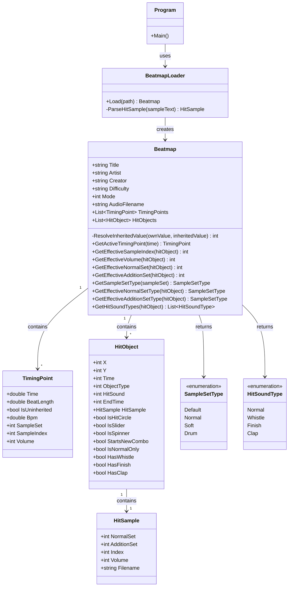
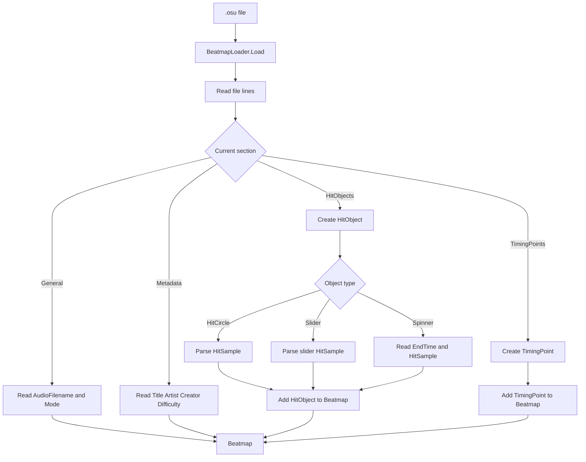
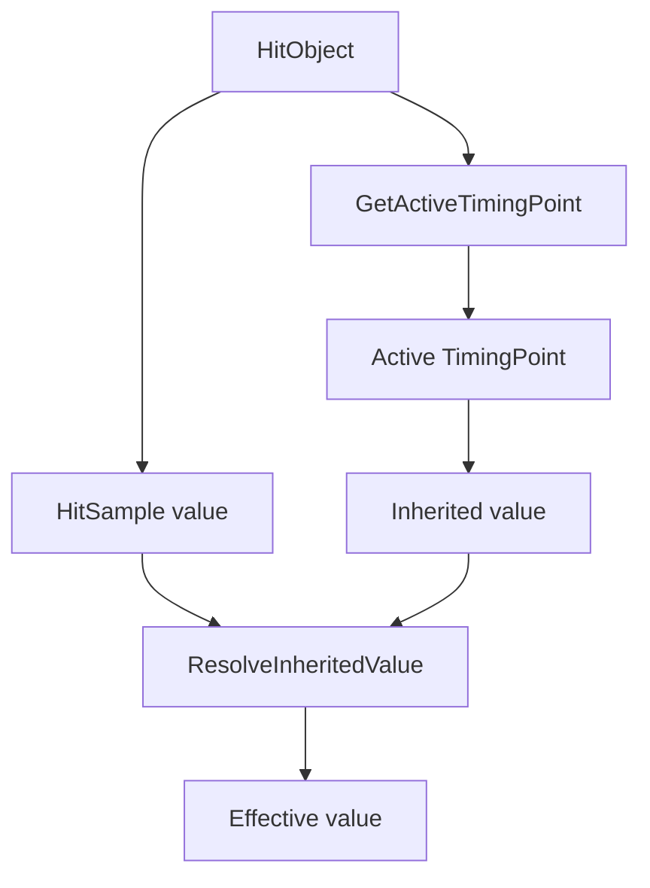
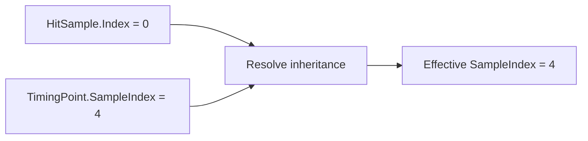
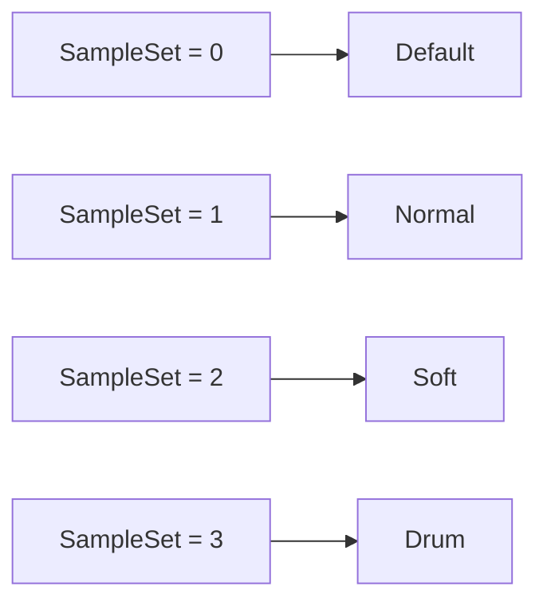
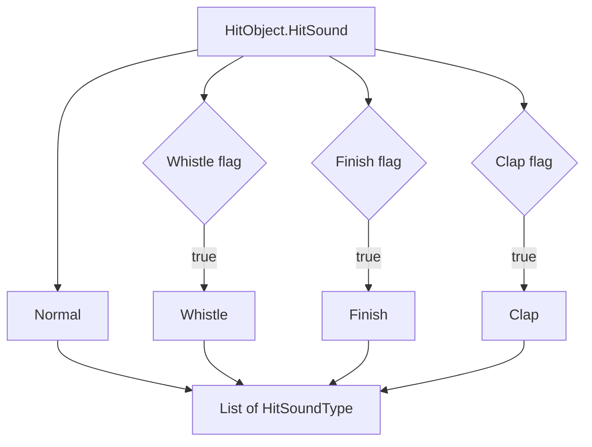
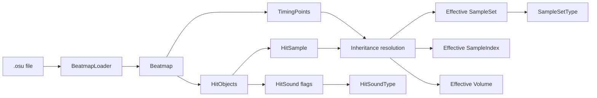
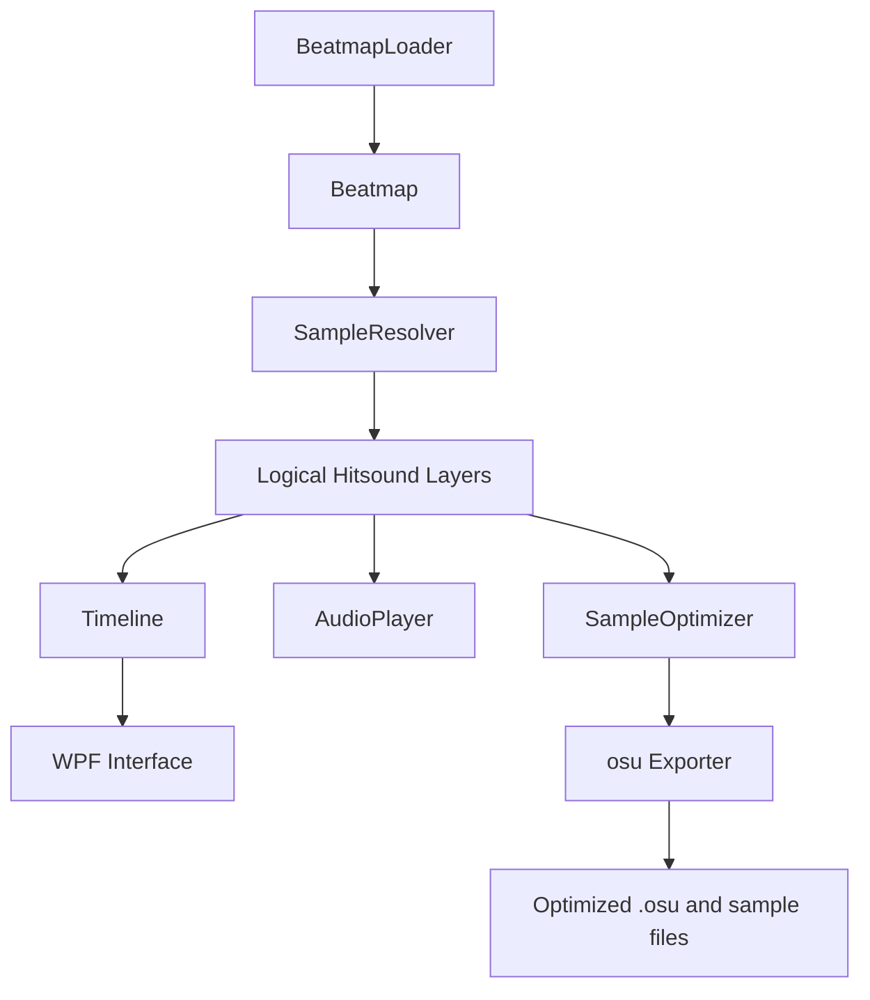
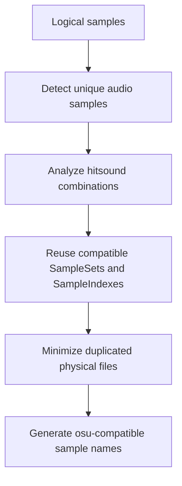

# Architecture

This document describes the current architecture of **osu-hitsound-editor**.

Its purpose is to provide a visual reference for how the classes are related and how data flows from an `.osu` file into the application's internal representation.

> The architecture will continue to evolve as the project grows.

---

## Current Class Structure



---

## Beatmap Loading Flow



---

## Hitsound Inheritance

`.osu` files can use values of `0` to indicate that certain properties should inherit their values from the active `TimingPoint`.



This process is currently used for:

```text
SampleIndex
Volume
NormalSet
AdditionSet
```

### Example



---

## Sample Set Resolution

Numeric sample set values from the `.osu` format are converted into clearer internal types.



This conversion is handled by:

```text
GetSampleSetType()
```

The following methods combine inheritance resolution with this conversion:

```text
GetEffectiveNormalSetType()
GetEffectiveAdditionSetType()
```

---

## Hitsound Resolution

`HitSound` uses bit flags that can be combined.

`HitObject` currently exposes:

```text
HasWhistle
HasFinish
HasClap
```

`Beatmap.GetHitSoundTypes()` converts those flags into a collection of `HitSoundType` values.



Example:

```text
HitSound = 10

Normal
Whistle
Clap
```

---

## Current Data Flow



---

## Tests

The project uses **xUnit** for automated testing.

```text
tests/
└── OsuHitsoundEditor.Tests/
    ├── BeatmapTests.cs
    ├── BeatmapLoaderTests.cs
    └── TestData/
        └── basic-beatmap.osu
```

The current test suite covers:

```text
SampleSetType conversion
HitSound flag combinations
Active TimingPoint resolution
SampleIndex inheritance
Volume inheritance
NormalSet inheritance
AdditionSet inheritance
Effective SampleSet types
Beatmap metadata parsing
TimingPoint parsing
HitObject type parsing
HitSample parsing
Spinner EndTime parsing
```

All tests can be executed from the repository root with:

```text
dotnet test
```

---

## Planned Architecture

The following components do **not exist yet**. They represent the current planned direction of the project.



### Planned Responsibilities

`SampleResolver`

```text
Determine which samples should actually be played for each HitObject.
```

`AudioPlayer`

```text
Play the beatmap audio and synchronize hitsounds with playback.
```

`Timeline`

```text
Represent HitObjects and hitsound events over time.
```

`SampleOptimizer`

```text
Reduce duplicate sample files and efficiently assign
SampleSets and SampleIndexes during export.
```

`Exporter`

```text
Generate or modify .osu files while preserving
the original beatmap information.
```

---

## Sample Optimization Goal

One of the main goals of the project is to avoid unnecessary duplication of sample files.

For example, the same kick sample may currently need to exist under several different sample indexes:

```text
drum-hitnormal2.wav
drum-hitnormal3.wav
drum-hitnormal4.wav
```

even when all three files contain exactly the same audio.

The future `SampleOptimizer` should analyze logical samples and their combinations before assigning osu! sample indexes.

Conceptually:



The editor should therefore avoid treating `SampleIndex` as the identity of a sound.

---

## Development Principle

The application should keep two concepts separate:

```text
Logical sample
    ↓
The actual sound the user wants to use

osu! representation
    ↓
SampleSet
SampleIndex
HitSound
Filename
```

This separation allows the editor to work with samples independently from osu!'s file naming and indexing system.

The exporter can then determine the most efficient valid representation when generating the final beatmap files.