# Architecture

This document describes the current architecture of **osu-hitsound-editor**.

Its purpose is to provide a visual reference for how `.osu` data is parsed, how timing and hitsound values are resolved, and how the current logical representation is separated from the physical sample representation that osu! uses.

> The architecture will continue to evolve as the project grows. This document describes the current implementation, not a final design.

---

## Current Stage

Hitsound Resolution is complete. The project is currently being prepared for public development, with Physical Sample Resolution planned next.

Current checkpoint:

```text
100/100 automated tests passing
```

The parser, timing resolution, logical hitsound resolution, slider edge/body behavior, and slider tick behavior are implemented.

Physical sample-file discovery and filename resolution have not been implemented yet. Those belong to the **Physical Sample Resolution** stage.

---

## Current Architecture Overview

The current implementation is intentionally small.

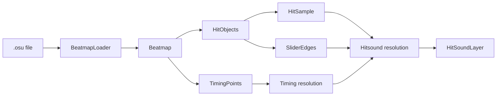

The main responsibilities are currently:

- `BeatmapLoader` parses `.osu` text into project objects.
- `Beatmap` owns beatmap-level data and the rules used to resolve timing and hitsounds.
- `TimingPoint` stores timing, sample-set, sample-index, and volume information.
- `HitObject` stores hit-circle, slider, and spinner data.
- `HitSample` stores the sample information attached to a hit object.
- `SliderEdge` stores hitsound information for the head, repeats, and tail of a slider.
- `HitSoundLayer` represents one logical sound layer after inheritance and timing rules have been resolved.

The current design keeps parsing and resolution separate:

```text
.osu text
    ↓
BeatmapLoader
    ↓
parsed Beatmap data
    ↓
Beatmap resolution methods
    ↓
logical HitSoundLayer values
```

---

## Current Class Structure

The diagram below intentionally shows the most relevant properties and methods rather than every member in every class.

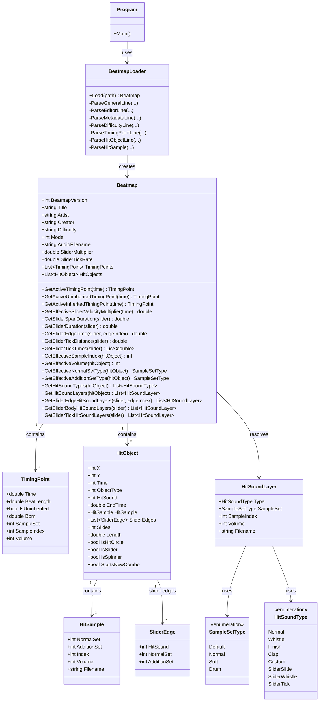

---

## Beatmap Loading Flow

`BeatmapLoader` reads the `.osu` file and builds the parsed model.

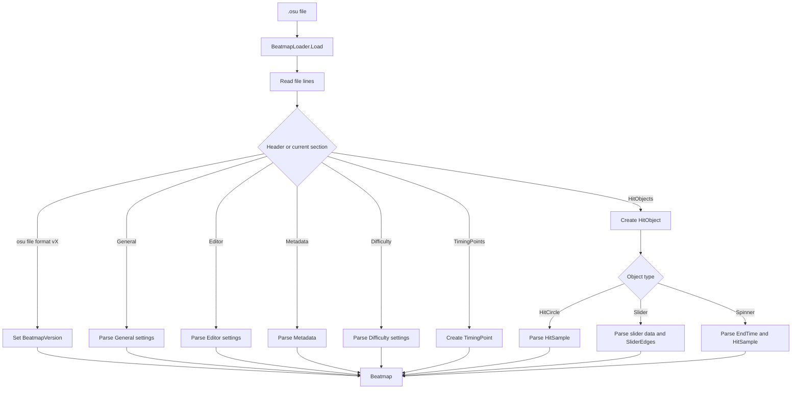

The loader is responsible for reading the file representation.

It does not decide which logical samples should ultimately play. That responsibility belongs to the resolution methods in `Beatmap`.

---

## Timing Resolution

Timing behavior is resolved at the time being queried.

The current timing methods are:

```text
GetActiveTimingPoint(double time)
GetActiveUninheritedTimingPoint(double time)
GetActiveInheritedTimingPoint(double time)
GetEffectiveSliderVelocityMultiplier(double time)
```

The distinction between timing-point types is important:

```text
uninherited timing point
    ↓
base beat length / BPM timing

inherited timing point
    ↓
slider velocity and sample-related inheritance
```

When no active inherited timing point exists, the effective slider velocity multiplier is:

```text
SV = 1.0
```

Otherwise, the current rule is:

```text
SV = 100 / -BeatLength
```

The methods use `double` time values because slider repeat and tail times may occur at fractional milliseconds.

---

## Hitsound Inheritance

Some `.osu` sample values use `0` to mean that the effective value must be inherited.

The current resolution flow is:

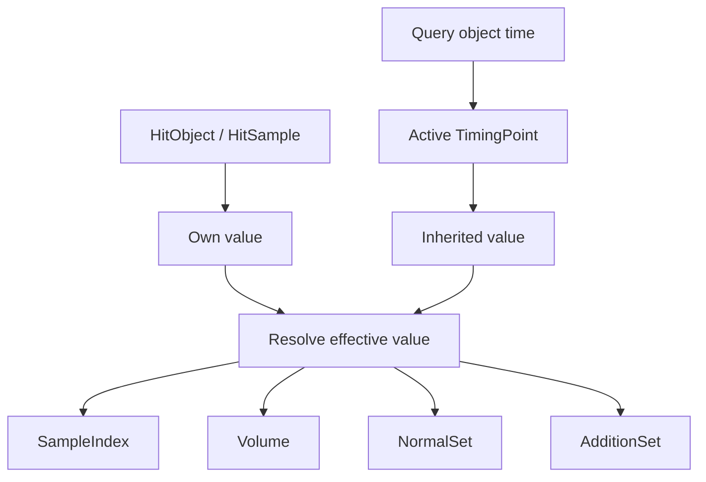

This resolution is used for:

```text
SampleIndex
Volume
NormalSet
AdditionSet
```

Sample-set inheritance can also fall back to the beatmap's default sample set when required.

---

## Sample Set Resolution

Numeric sample-set values from the `.osu` format are converted into `SampleSetType`.

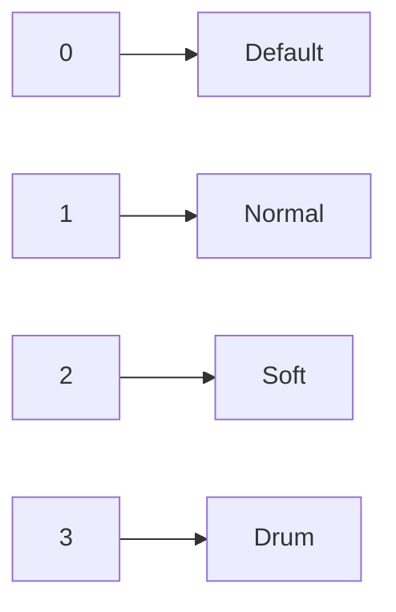

The effective sample-set methods combine inheritance with this conversion:

```text
GetEffectiveNormalSetType()
GetEffectiveAdditionSetType()
```

The logical representation uses `SampleSetType` instead of carrying the raw integer everywhere.

---

## Logical Hitsound Resolution

`HitSound` uses bit flags that may be combined.

The base object hitsounds are:

```text
Normal
Whistle
Finish
Clap
```

`GetHitSoundTypes()` interprets those flags.

`GetHitSoundLayers()` then resolves the information required by each sound layer:

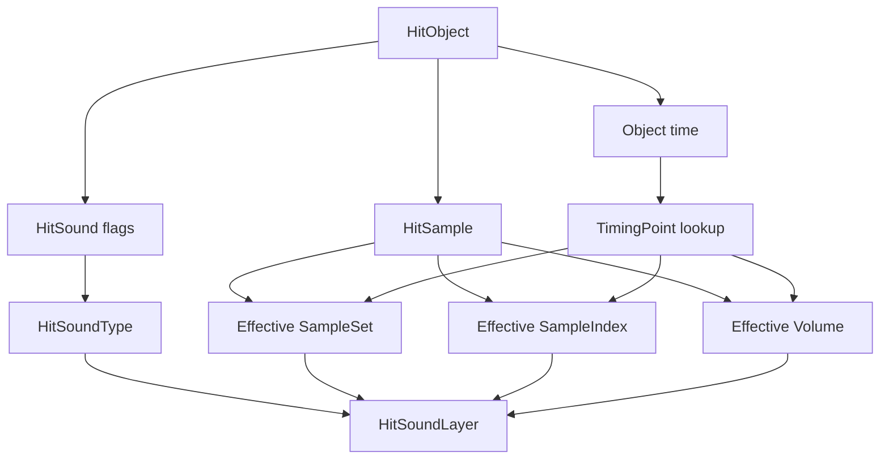

A `HitSoundLayer` describes the logical result:

```text
Type
SampleSet
SampleIndex
Volume
Filename
```

At this stage, the layer describes **what should sound logically**.

It does not yet guarantee that the corresponding physical sample file has been discovered or resolved from disk.

---

## Slider Timing

Slider timing is calculated in `Beatmap`.

### Span duration

Conceptually:

```text
spanDuration =
    slider.Length
    / (SliderMultiplier * 100 * SV)
    * activeUninheritedTimingPoint.BeatLength
```

`GetSliderSpanDuration()` requires:

- a valid positive `SliderMultiplier`
- an active uninherited timing point

Invalid states throw instead of returning valid-looking fallback values.

### Total duration

```text
sliderDuration =
    spanDuration * Slides
```

`Slides` represents the number of spans.

### Edge time

```text
edgeTime =
    slider.Time
    + spanDuration * edgeIndex
```

Edge indexes are interpreted as:

```text
0                 head
1 .. Slides - 1   repeats
Slides            tail
```

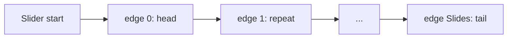

---

## Slider Edge Hitsounds

A slider may define different hitsound information for each edge.

The number of expected edges is:

```text
Slides + 1
```

`GetSliderEdgeHitSoundLayers()` first calculates the real time of the requested edge and then resolves that edge using the timing point active at that exact time.

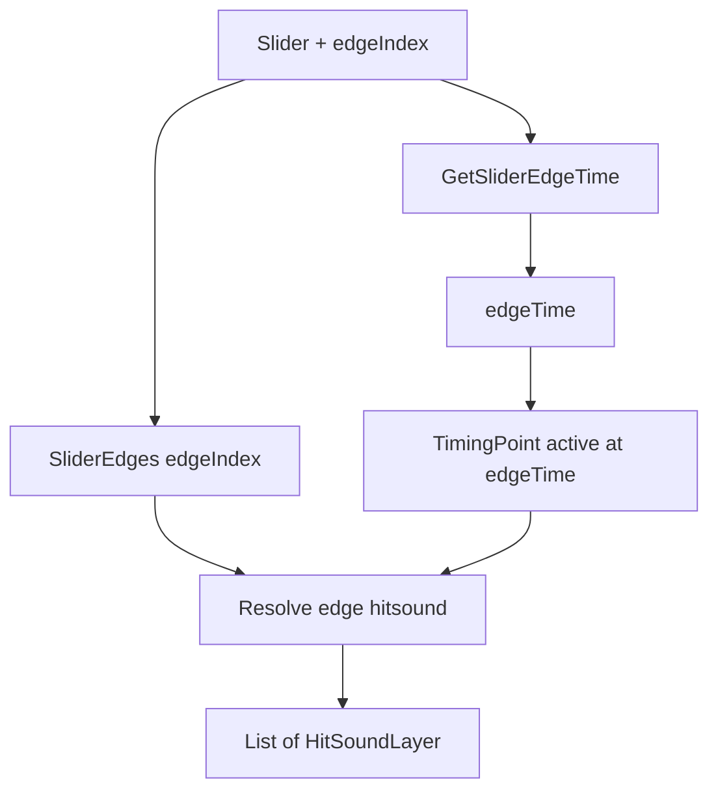

This means a repeat or tail may inherit a different `SampleSet`, `SampleIndex`, or `Volume` from the slider head if a relevant timing point changes during the slider.

---

## Continuous Slider Body Hitsounds

The slider body has continuous sounds that are separate from the discrete head, repeat, tail, and tick events.

`GetSliderBodyHitSoundLayers()` resolves:

```text
SliderSlide
SliderWhistle
```

`SliderSlide` is always part of the continuous slider body.

`SliderWhistle` is added when the slider's whistle hitsound is enabled.

`Finish` and `Clap` are not treated as continuous slider-body sounds.

---

## Slider Ticks

Slider ticks have their own timing and logical hitsound behavior.

### Tick distance

The base tick distance is:

```text
baseTickDistance =
    SliderMultiplier * 100 / SliderTickRate
```

For beatmap formats before version 8:

```text
tickDistance = baseTickDistance
```

For version 8 and newer:

```text
tickDistance =
    baseTickDistance * effectiveSliderVelocityMultiplier
```

This distinction is represented explicitly through `BeatmapVersion`.

### Tick times

`GetSliderTickTimes()` calculates tick times for every slider span.

The current flow is:

```text
calculate span duration
calculate tick distance
calculate slider velocity
calculate the 10 ms end exclusion distance

for each span
    determine whether the span is reversed
    calculate ticks along the path
    convert path progress to time progress
    return ticks in chronological order
```

Ticks at or too close to the span end are not generated.

For reversed spans, path progress is inverted and the generated values are reordered so the returned list remains chronological.

### Tick hitsound

`GetSliderTickHitSoundLayers()` produces one logical layer:

```text
SliderTick
```

The tick uses the slider's effective normal sample set, sample index, and volume.

It does not use the slider's addition sample set.

---

## Slider Audio Overview

The slider audio responsibilities are currently separated like this:

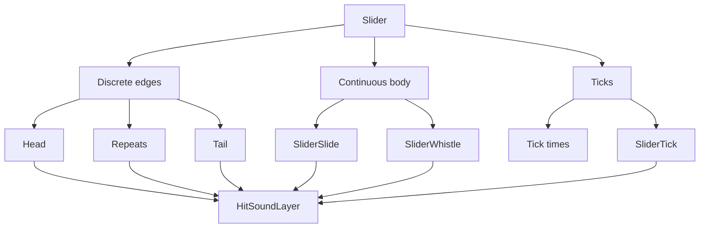

These responsibilities remain separate because they occur at different times and follow different osu! rules.

---

## Current Data Flow

The current overall flow is:

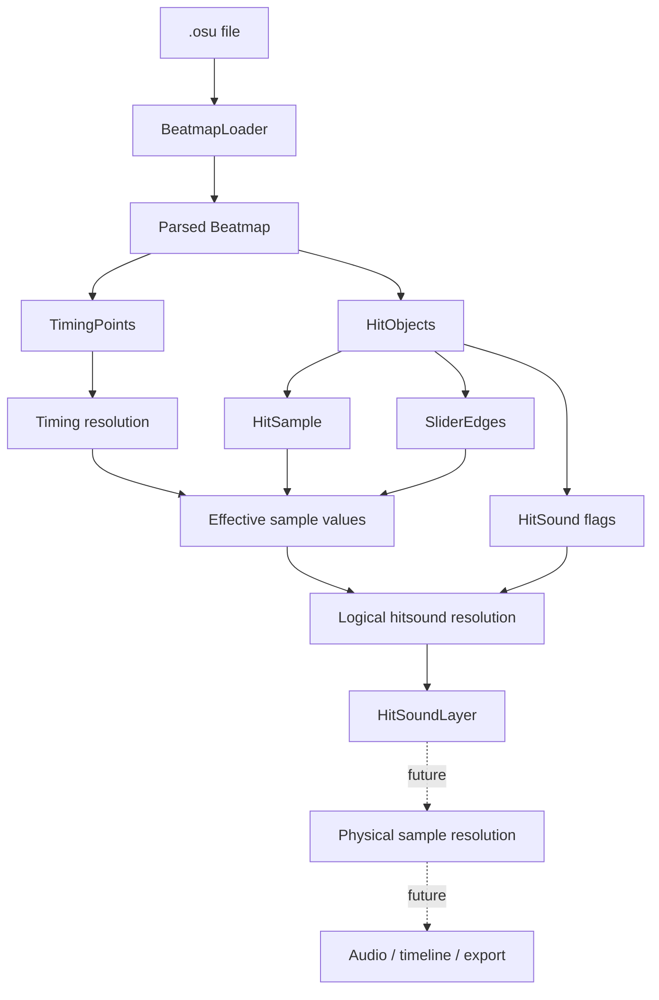

The dashed part of the diagram is intentionally not implemented yet.

---

## Current Architectural Boundary

The project currently stops at the logical hitsound representation.

Implemented:

```text
.osu parsing
    ↓
timing resolution
    ↓
effective hitsound values
    ↓
logical HitSoundLayer
```

Not implemented yet:

```text
physical sample-file discovery
    ↓
physical filename resolution
    ↓
audio playback
    ↓
timeline editing
    ↓
export
    ↓
optimization
```

This boundary is intentional.

The project should understand the logical behavior of the beatmap before physical sample files, playback, export, and optimization are layered on top.

---

## Tests

The project uses **xUnit** for automated testing.

Current checkpoint:

```text
100/100 tests passing
```

The test suite currently covers:

```text
.osu parsing
beatmap settings and metadata
BeatmapVersion parsing
TimingPoint parsing
active timing-point resolution
active inherited/uninherited timing points
slider velocity resolution
SampleSetType conversion
SampleIndex inheritance
Volume inheritance
NormalSet inheritance
AdditionSet inheritance
beatmap default sample set
HitSound flag combinations
logical HitSoundLayer resolution
slider span duration
slider total duration
slider edge timing
slider edge hitsounds
continuous SliderSlide
continuous SliderWhistle
slider tick distance
pre-v8 / v8+ tick behavior
slider tick times
normal and reversed slider spans
SliderTick hitsound layers
invalid-state and boundary cases
```

The tests are located under:

```text
tests/
└── OsuHitsoundEditor.Tests/
    ├── BeatmapTests.cs
    ├── BeatmapLoaderTests.cs
    ├── TestOrganizationTests.cs
    └── TestData/
        └── basic-beatmap.osu
```

Run the complete suite from the repository root with:

```bash
dotnet test
```

---

## Planned Development Stages

The following sections describe responsibilities that are planned but not yet implemented.

They are written as responsibilities rather than fixed class names because the project intentionally avoids committing to abstractions before they are needed.

### Physical Sample Resolution

Planned responsibilities:

```text
discover sample files used by the beatmap
resolve osu! sample filenames
separate logical sample identity from physical representation
define a stable logical SampleId
load required sample metadata
handle missing samples predictably
```

### Audio Infrastructure

Planned responsibilities:

```text
decode required audio formats
play beatmap audio
seek
play hitsound layers together
synchronize playback with the editor timeline
handle audio-device errors
```

An external open-source .NET library may be used for low-level audio infrastructure after independent evaluation.

### Desktop Editor and Timeline

Planned responsibilities:

```text
WPF application shell
open beatmap
timeline
playhead
zoom
waveform
hitsound events and tracks
selection
editing
snapping
```

### Export and Round-Trip Verification

The exporter must eventually support this deterministic cycle:

```text
parse
    ↓
logical representation
    ↓
export
    ↓
reload
    ↓
logical equivalence verification
```

The equivalence check must verify relevant properties such as:

```text
samples
multiplicity
timing
volume
overlaps
```

This stage must work before global sample optimization is introduced.

### Sample Optimization

The intended optimization priority is:

```text
1. Minimize redundant physical sample files.
2. Among equally minimal solutions, minimize effective SampleSet/SampleIndex combinations.
3. Preserve logical and sonic behavior.
```

A deterministic approach should be preferred first.

A global optimizer such as CP-SAT should only be considered if the problem later demonstrates that it actually requires one.

### Integration and Release Polish

Later work includes:

```text
error handling
larger beatmap testing
performance profiling
usability review
packaging
documentation
release preparation
```

---

## Sample Optimization Goal

One of the long-term goals of the project is to avoid unnecessary duplication of sample files.

For example:

```text
drum-hitnormal2.wav
drum-hitnormal3.wav
drum-hitnormal4.wav
```

may all contain the same logical audio sample.

The future optimization system should reason about the logical sample first and only then decide how that sound should be represented through osu!'s physical file/index system.

Conceptually:

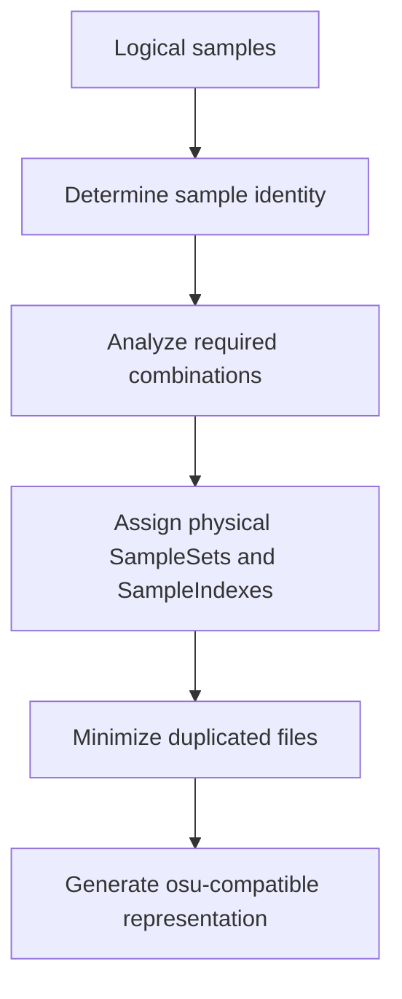

The optimizer must not assume that two samples are equivalent simply because they sound similar.

Sample equivalence must be based on an explicit rule, such as identical audio content or an equivalence declared by the system or user.

---

## Development Principles

### Logical and physical sample identity remain separate

The project keeps these concepts separate:

```text
Logical sample
    ↓
The actual sound that should be used

Physical osu! representation
    ↓
SampleSet
SampleIndex
HitSound
Filename
```

`SampleSet`, `SampleIndex`, and filename are encoding choices. They are not automatically the identity of the logical sound.

### Core domain logic remains inside the project

The following areas are primarily implemented by this project:

```text
.osu parsing
osu! timing behavior
logical hitsound representation
export
sample optimization
```

External libraries are acceptable for infrastructure such as audio playback or generic UI components when they provide a real benefit.

### Avoid premature abstractions

New interfaces, helper classes, resolver classes, or architectural layers should not be introduced only because they might be useful later.

A new abstraction should solve a real problem that already exists.

### Tests are the primary verification mechanism

Functional behavior should be verified with tests before moving to the next responsibility.

An AI suggestion, documentation statement, or architectural idea does not override behavior that has already been verified by the source code and tests.

### Official osu! behavior is verified rather than guessed

When format or gameplay behavior is uncertain, use:

```text
1. official osu! documentation
2. official osu! open-source implementation
```

instead of assuming how the format behaves.
